# TradingView Widgets for Obsidian

TradingView Widgets renders official [TradingView embeddable widgets](https://www.tradingview.com/widget-docs/) from safe Markdown code blocks in Obsidian desktop and mobile.

Instead of pasting raw `<script>` tags or `<iframe>` embeds into your vault, you write a normal fenced `tradingview` code block. The plugin reads that YAML configuration and creates the official TradingView widget safely at render time.

Use it to add live charts, tickers, market data, heatmaps, screeners, symbol details, news, and calendars to your notes while keeping the note itself readable, portable, and script-free.

````markdown
```tradingview
widget: advanced-chart
symbol: NASDAQ:AAPL
interval: D
theme: auto
height: 600
autosize: true
```
````

## Screenshots

Rendered widgets from a demo note:

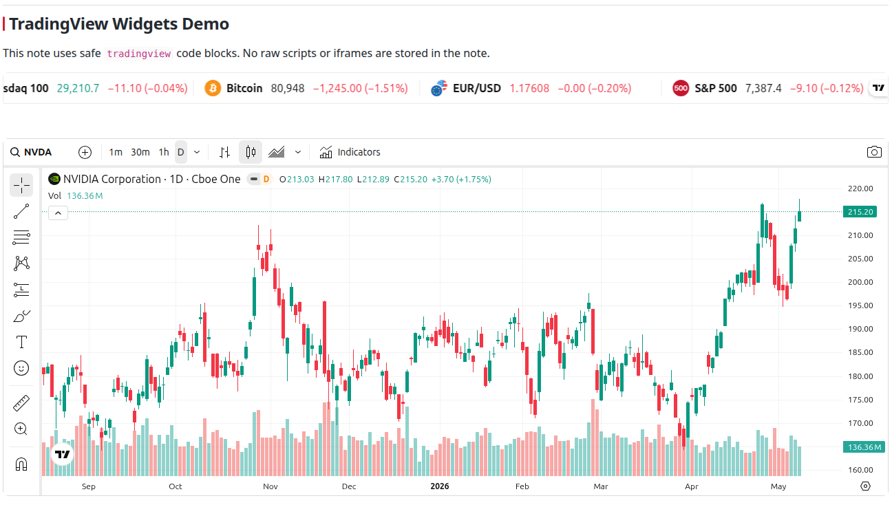

The same idea as plain Markdown: safe `tradingview` code blocks, not raw scripts or iframes:

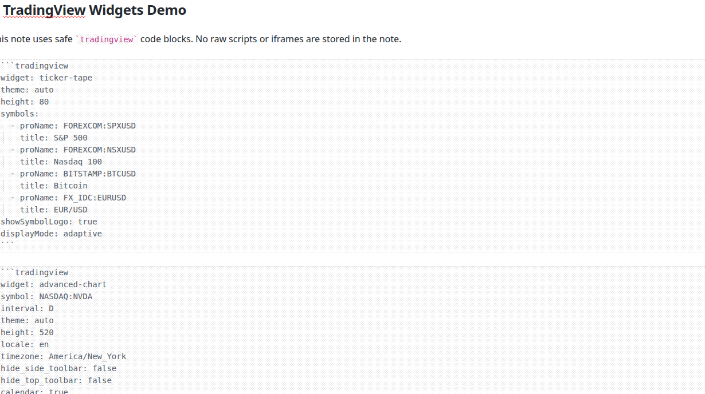

## Based on TradingView widgets

This plugin is a safe Obsidian wrapper around TradingView's public embed widgets. The widget configuration options come from TradingView's official documentation:

- [TradingView Widget Docs](https://www.tradingview.com/widget-docs/)
- [All widgets](https://www.tradingview.com/widget-docs/widgets/)
- [Advanced Chart widget](https://www.tradingview.com/widget-docs/widgets/charts/advanced-chart/)

Most TradingView widget options are supported. Add any option from TradingView's docs directly to the `tradingview` YAML block and the plugin passes it to the selected widget.

### Current exceptions

- Only TradingView's public `s3.tradingview.com/external-embedding` widgets are supported.
- TradingView web components, the Charting Library, Broker widgets, custom Pine scripts, and authenticated/private TradingView features are not embedded by this plugin.
- The plugin does not run arbitrary raw HTML or user-provided scripts from notes.
- Widgets require internet access to load TradingView's embed scripts and market data.

## Installation with BRAT

This plugin is not in the official Obsidian community plugin list yet. Install it with BRAT:

1. In Obsidian, install and enable **BRAT** ("Beta Reviewers Auto-update Tester") from Community Plugins.
2. Open **Settings → BRAT**.
3. Choose **Add Beta plugin**.
4. Paste this repository URL:
   ```text
   https://github.com/TfTHacker/tradingview-widgets
   ```
5. Confirm the install and let BRAT download the latest release.
6. Enable **TradingView Widgets** in **Settings → Community plugins**.

## How to add a widget

### Option 1: Use the Widget Wizard

Run **TradingView Widgets: Widget Wizard** from the command palette.

The wizard helps you:

- Choose a supported TradingView widget.
- Look up TradingView symbols with logos when available.
- Configure symbol(s), interval, theme, height, width, locale, timezone, attribution, lazy loading, and widget-specific options.
- Add advanced YAML for any TradingView option that is not shown as a guided control.
- Copy the generated code block or insert it into the current note.

### Option 2: Use Quick Insert

Run **TradingView Widgets: Quick Insert Widget** from the command palette.

Quick Insert is best when you want a common widget fast. Widgets that accept multiple symbols let you add several symbols before inserting the block.

### Option 3: Write a code block manually

Add a fenced code block with the language `tradingview`:

````markdown
```tradingview
widget: ticker
symbol: NASDAQ:MSFT
theme: auto
height: 120
```
````

The block uses YAML. JSON-style values also work because YAML accepts JSON objects and arrays.

## Common block options

These options are handled by the plugin for every widget:

- `widget` or `type`: The widget id, for example `advanced-chart` or `ticker-tape`.
- `theme`: `auto`, `light`, or `dark`. `auto` follows Obsidian's current theme when the block renders.
- `height`: Widget wrapper height in pixels. Values are clamped between `80` and `2000`.
- `width`: `100%`, a pixel value like `700`, or CSS units such as `50vw`, `40rem`, or `800px`.
- `locale`: TradingView locale, for example `en`.
- `timezone`: Used by widgets that support it, especially `advanced-chart`.
- `showAttribution`: Show the compact TradingView attribution link. Defaults to the plugin setting.
- `lazyLoad`: Load only when the widget approaches the viewport. Defaults to the plugin setting.

Any non-reserved key is passed through to TradingView. For example, `hide_top_toolbar`, `showSymbolLogo`, `importanceFilter`, `defaultScreen`, `blockColor`, and `displayMode` are TradingView widget options.

## Supported widgets

- `advanced-chart` — full interactive chart.
- `symbol-overview` — multi-symbol overview chart.
- `mini-symbol-overview` — compact mini chart.
- `ticker-tape` — scrolling ticker tape.
- `ticker` — single ticker / single quote.
- `tickers` — row of multiple tickers.
- `market-overview` — grouped market overview with chart.
- `market-data` — market quotes / market data list.
- `stock-heatmap` — stock market heatmap.
- `forex-heatmap` — currency heatmap.
- `crypto-coins-heatmap` — crypto market heatmap.
- `screener` — stock/market screener.
- `technical-analysis` — TradingView technical analysis summary.
- `symbol-info` — symbol information card.
- `company-profile` — company profile.
- `fundamental-data` — financial / fundamental data.
- `top-stories` — TradingView news feed.
- `economic-calendar` — economic calendar.

Aliases also work for several widgets. Examples: `chart`, `advanced`, `overview`, `mini`, `tape`, `quote`, `market-quotes`, `heatmap`, `financials`, `news`, and `calendar`.

## Examples

### Advanced chart

````markdown
```tradingview
widget: advanced-chart
symbol: NASDAQ:NVDA
interval: D
theme: auto
height: 650
locale: en
timezone: America/New_York
hide_side_toolbar: false
hide_top_toolbar: false
calendar: true
allow_symbol_change: true
```
````

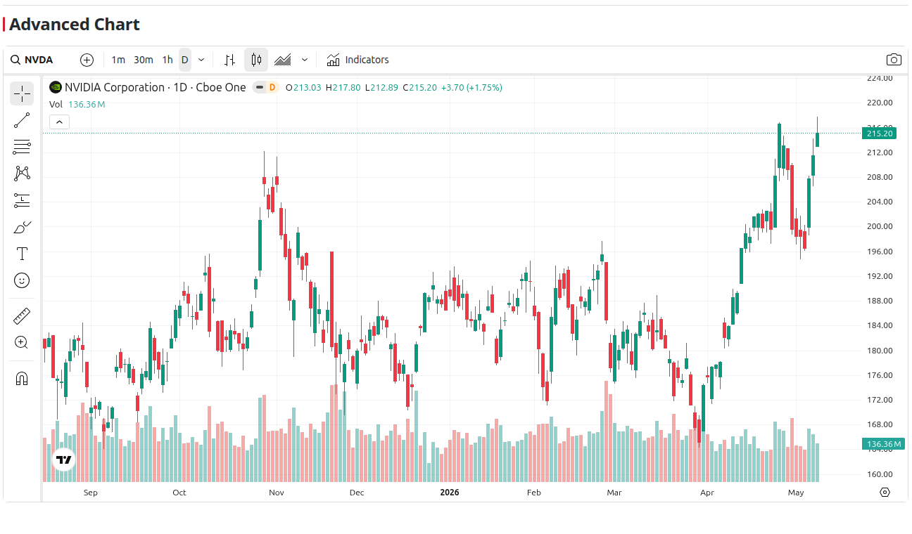

### Mini chart

````markdown
```tradingview
widget: mini-symbol-overview
symbol: NASDAQ:AAPL
dateRange: 12M
theme: auto
height: 220
isTransparent: true
```
````

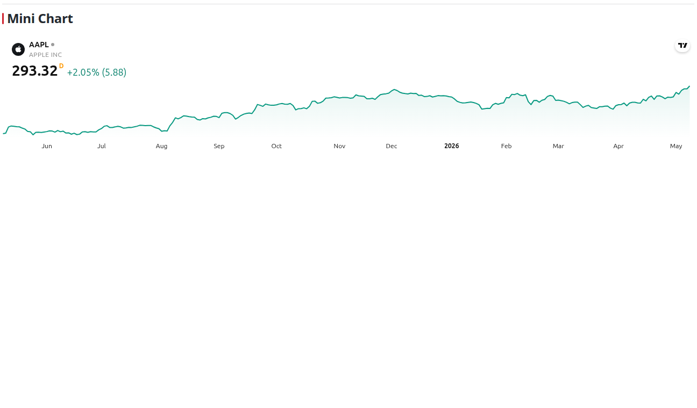

### Ticker tape

````markdown
```tradingview
widget: ticker-tape
theme: auto
height: 80
symbols:
  - proName: FOREXCOM:SPXUSD
    title: S&P 500
  - proName: FOREXCOM:NSXUSD
    title: Nasdaq 100
  - proName: BITSTAMP:BTCUSD
    title: Bitcoin
  - proName: FX_IDC:EURUSD
    title: EUR/USD
showSymbolLogo: true
displayMode: adaptive
```
````

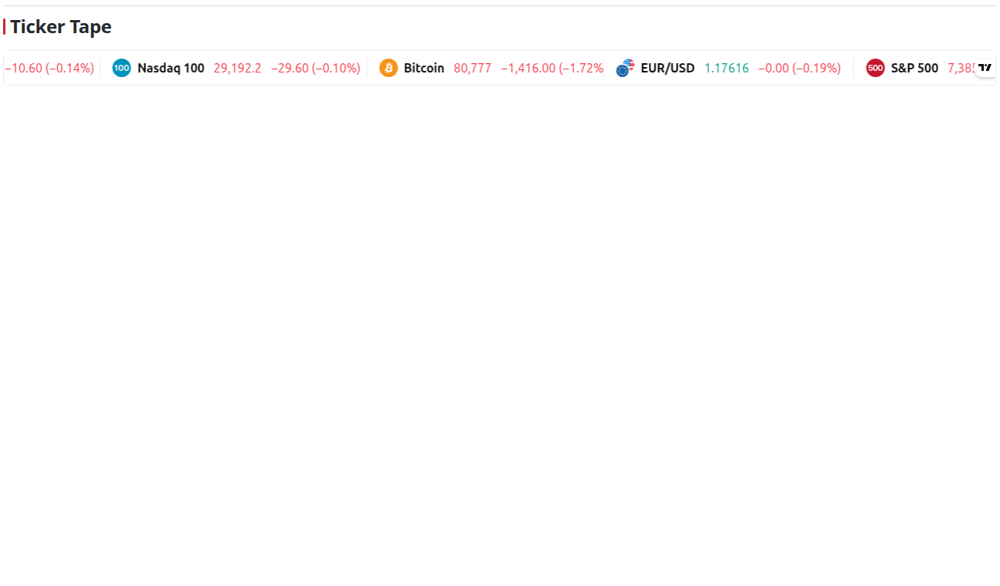

### Multiple tickers

````markdown
```tradingview
widget: tickers
theme: dark
height: 120
symbols:
  - proName: NASDAQ:AAPL
    title: Apple
  - proName: NASDAQ:MSFT
    title: Microsoft
  - proName: NASDAQ:GOOGL
    title: Alphabet
showSymbolLogo: true
```
````

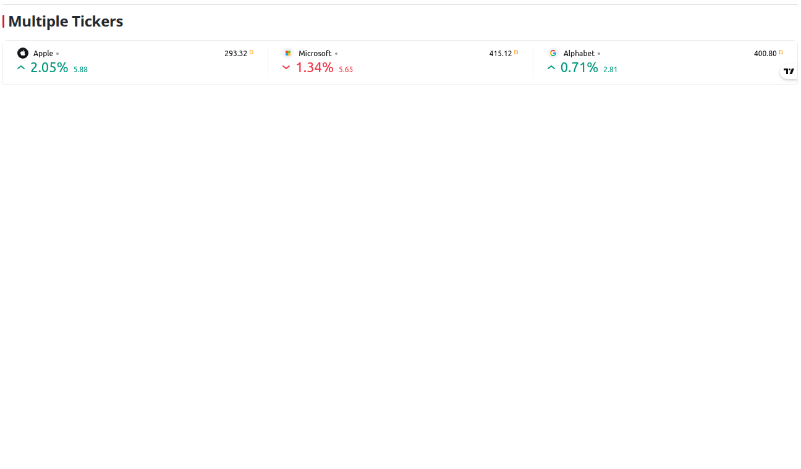

### Symbol overview

````markdown
```tradingview
widget: symbol-overview
theme: auto
height: 420
symbols:
  - [Apple, AAPL|1D]
  - [Microsoft, MSFT|1D]
  - [Nvidia, NVDA|1D]
chartType: area
showVolume: true
showMA: true
changeMode: price-and-percent
```
````

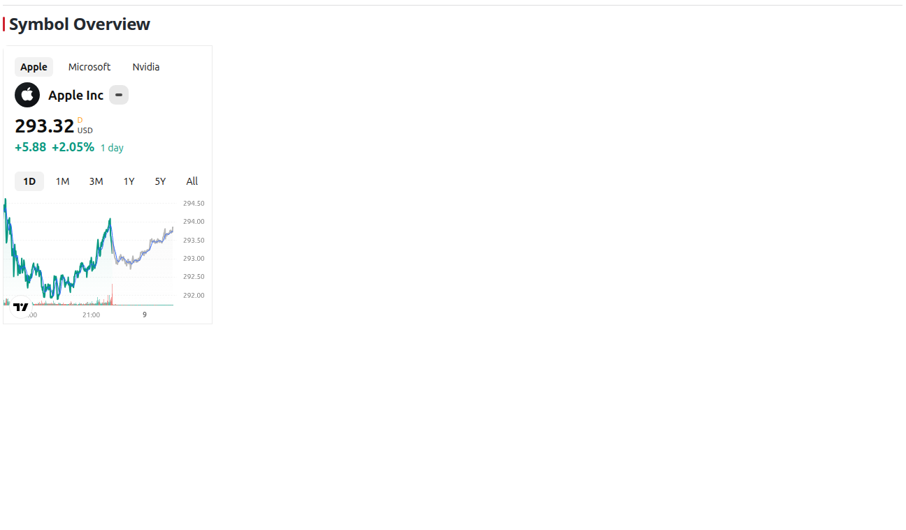

### Stock heatmap

````markdown
```tradingview
widget: stock-heatmap
theme: auto
height: 520
dataSource: SPX500
grouping: sector
blockSize: market_cap_basic
blockColor: change
hasTopBar: true
isZoomEnabled: true
hasSymbolTooltip: true
```
````

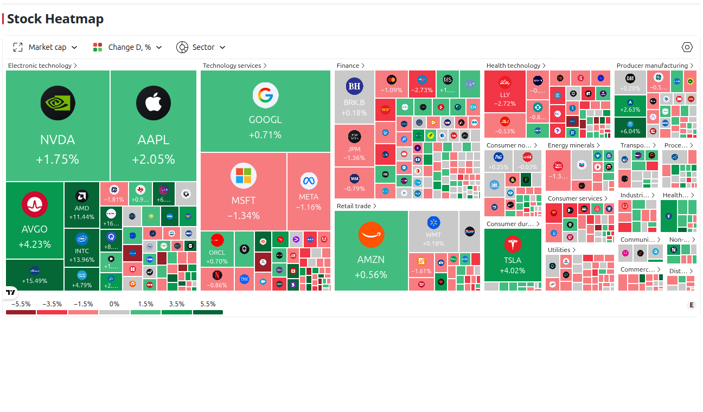

### Screener

````markdown
```tradingview
widget: screener
theme: auto
height: 600
market: america
defaultScreen: most_capitalized
defaultColumn: overview
showToolbar: true
```
````

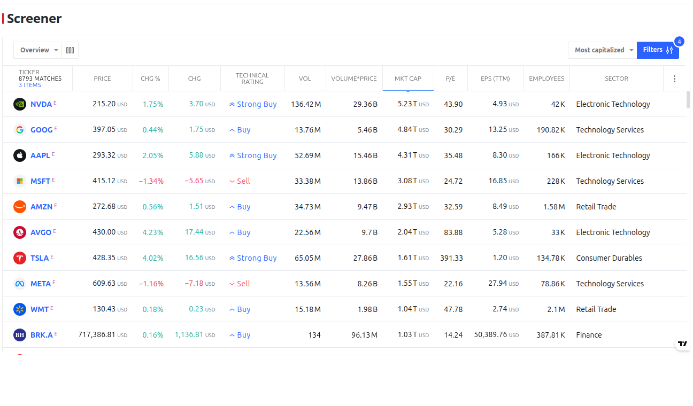

### Technical analysis

````markdown
```tradingview
widget: technical-analysis
symbol: NASDAQ:TSLA
interval: 1m
theme: auto
height: 450
showIntervalTabs: true
displayMode: single
```
````

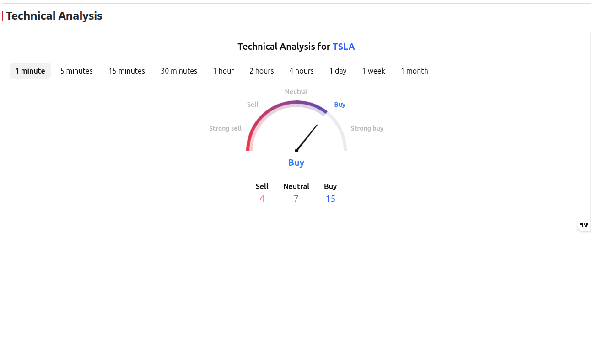

### Economic calendar

````markdown
```tradingview
widget: economic-calendar
theme: auto
height: 550
importanceFilter: "0,1"
locale: en
```
````

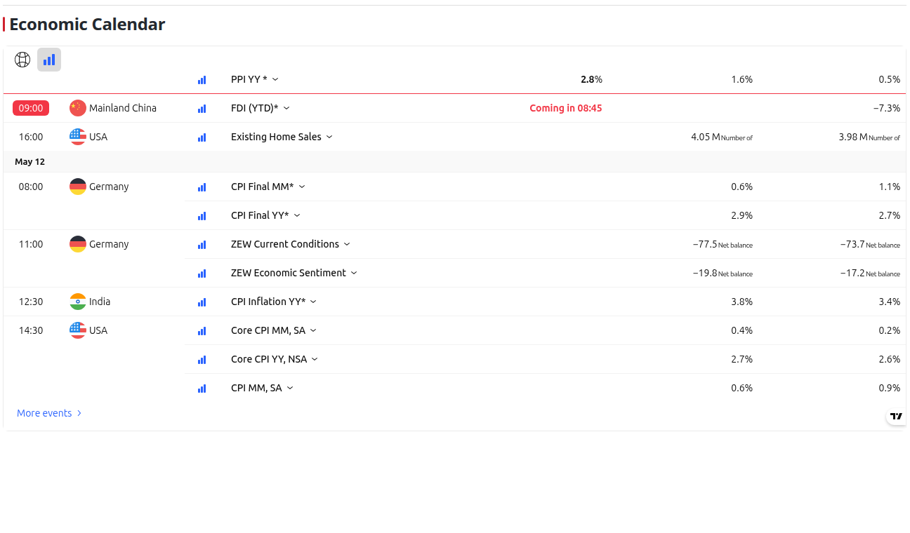

## Settings

Open **Settings → TradingView Widgets** to configure defaults:

- Default widget type.
- Default height.
- Default locale.
- Default timezone.
- Whether attribution is shown by default.
- Whether widgets lazy-load by default.
- Whether rendered widgets refresh when Obsidian changes between light and dark theme.

Per-block options override plugin settings.

## Tips

- Use `theme: auto` for notes that should look right in both light and dark mode.
- Keep `lazyLoad: true` for dashboards with many widgets. Set `lazyLoad: false` when you need a widget to load immediately.
- Use the Wizard's advanced YAML section when TradingView documents an option that does not have a dedicated control yet.
- If a widget shows an error, first verify the `widget` id and YAML indentation.
- If TradingView changes a widget option, update the YAML block to match the current [TradingView docs](https://www.tradingview.com/widget-docs/widgets/).

## Built with Hermes Agent

This plugin was coded with [Hermes Agent](https://hermes-agent.nousresearch.com/), the author's AI coding agent, through an iterative Obsidian plugin development workflow.

## Privacy and security

The plugin avoids arbitrary note scripts. It creates the official TradingView embed script for the selected widget and passes your YAML settings as the widget configuration.

TradingView widgets are remote embeds, so TradingView receives the normal network requests needed to load and render the widget. Symbols and configuration values in a widget block may be included in those requests.
